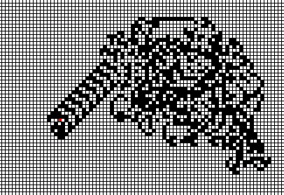

# processing-langtons-ant

A simulation of Langton's Ant using Processing

You can read more about it [here](https://en.wikipedia.org/wiki/Langton's_ant).

## 🧐 How does it work

The ant starts at the center of the matrix, facing one of the four directions. All cells are initially white. Then, according to the color of the cell the ant is currently in, it must move according to these rules:

- If the cell is black, change the cell to white and turn left
- If the cell is white, change the cell to black and turn right

## 💡 How to use

1. Clone this repo.
2. Open the file [Langtons_Ant.pde](./Langtons_Ant/Langtons_Ant.pde) using Processing.
3. Click play and watch the ant go.

By the step 10000, you should start to see the pattern.
